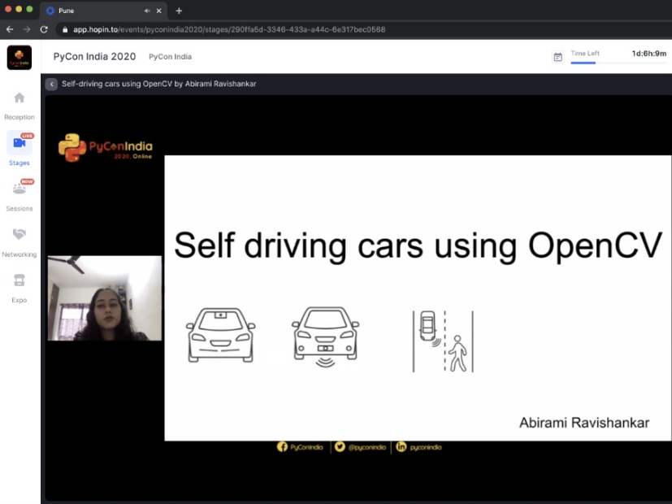

I got the opportunity to deliver a talk at PyCon India 2020. PyCon India is the largest gathering of Python enthusiasts in India. It is a community-run conference celebrating the use of Python Software across a wide variety of industries. The conference was (virtually) attended by more than 600 participants including working professionals, students, and hobbyists. My talk about Self Driving cars was selected from over 200 proposals. My talk explored the use of OpenCV in tackling a variety of challenges related to Self Driving cars. This included topics like obstacle avoidance, lane detection, traffic light, and sign detection, pedestrian detection in detail, and how I implemented it. The talk was well received and it was a great experience for me overall. I got to meet other people who are working on similar projects, hear their ideas, and explore future collaboration.
